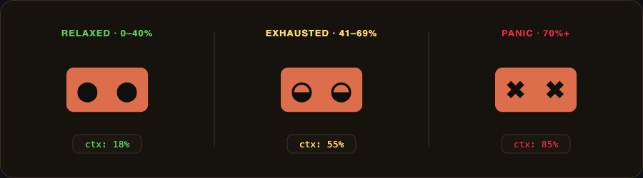
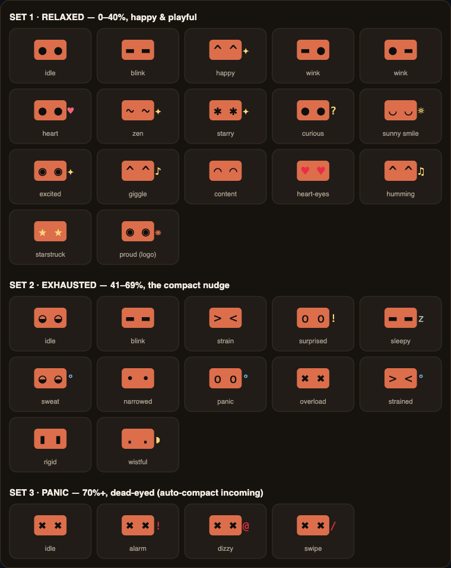

# 🐾 claude-pet

> A pixel-art Claude that lives in your statusline and tells you — through sheer existential dread — when it's time to `/compact`.

## What is it?

A self-contained Bash script that prints one **5-cell mascot frame** every time Claude Code refreshes your statusline (about once a second). It blinks, glances, and emotes — a pixel-art Claude with a chunky orange body — and reacts to how full your context window is.

The animation isn't a fixed loop: each refresh picks a **weighted-random** frame, so the pet feels alive rather than metronomic.
<p align="center">
  
</p>

<h3 align="center">
  <a href="https://amirya412.github.io/claude-code-pet/">▶ Try the interactive demo</a>
</h3>

## Why it's nice

- **Zero forks, zero temp files.** Pure Bash builtins + `$RANDOM`.
- **Never loops.** Weighted-random frames feel alive, not robotic.
- **Context-aware.** Three tiers — relaxed (0–40%), exhausted (41–69%), panic (70%+) — a building nudge to `/compact`.
- **No jitter.** Every frame is exactly 5 terminal cells wide.
- **One file.** Drop it in, point your statusline at it.
- **Mostly idle.** It rests, blinks, and glances far more than it emotes.

## Expressions

The pet has three moods, switched by context-window usage:

- 🙂 **Relaxed** (`0–40%`) — happy & playful. Emotes roughly every 6 seconds.
- 😩 **Exhausted** (`41–69%`) — strained. Emotes more often (~every 4.5 s) — your cue to compact.
- 💀 **Panic** (`70%+`) — a dead-eyed `✖ ✖` stare (no more blinking). Auto-compact is closing in.

> [!WARNING]
> Past **41%** the pet looks exhausted; past **70%** it flips to a panic `✖ ✖` stare — your signal to `/compact` before auto-compact kicks in around 95%.

Here's the full cast:

<p align="center">
  
</p>


## Install

### Requirements

- **[Claude Code](https://code.claude.com/docs)** — Anthropic's CLI; see the docs to install.
- **[`jq`](https://jqlang.github.io/jq/)** — **required**: the installer edits `settings.json` with it, and the statusline wrapper parses the context JSON on every redraw. Install with `brew install jq` (macOS) or `sudo apt install jq` (Debian/Ubuntu).
- **Bash ≥ 3.2** — the pet and wrapper are Bash scripts (macOS/Linux have it; on **Windows** run the install in **Git Bash or WSL**, not PowerShell).
- **A Modern Terminal** - For color support. 

### One command

```bash
curl -fsSL https://raw.githubusercontent.com/AmirYa412/claude-code-pet/main/claude-pet-install.sh | bash
```

Cloned the repo instead? Run `bash claude-pet-install.sh`.

It drops the pet **and** the statusline wrapper into `~/.claude` and wires `settings.json` (`refreshInterval: 1`, which drives the ~1 fps animation) with a timestamped backup.

---

<p align="center"><sub>Made with 🐾 for Claude Code statuslines.</sub></p>
